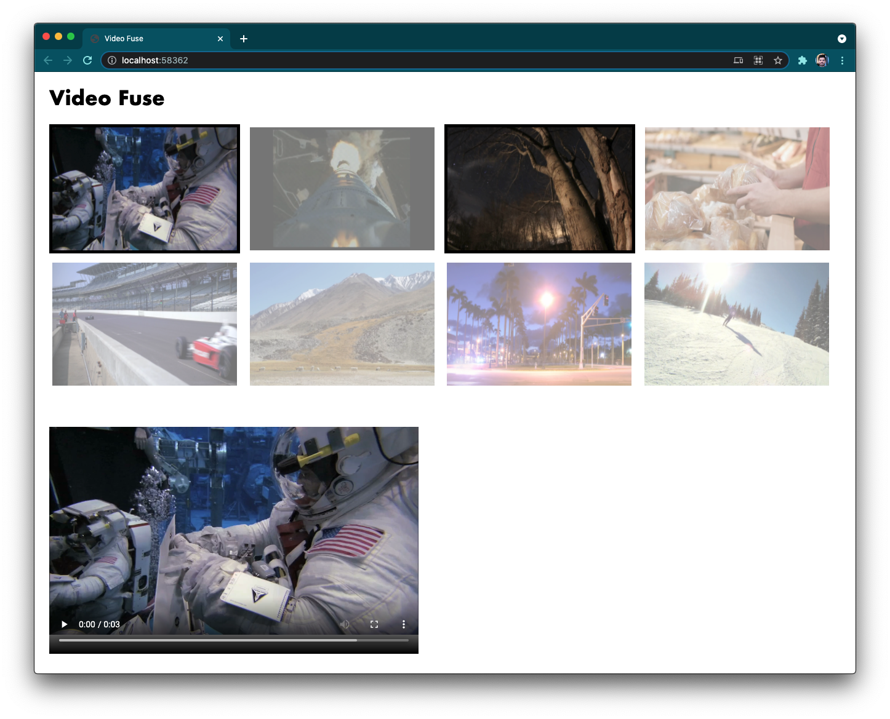

## Cquence Front-End Coding Challenge (Video Fuse)

### Description

A friend of yours has an idea for a new video editing app, and they need your help building out the front-end! The eventual goal is to allow users to search for videos based on objects that appear in the video, trim those videos into clips, and then fuse those clips into a new video. Getting early and fast feedback is crucial, so the first version of the app will be _greatly_ simplified. Your goal is to implement the following design:

The steps below help explain the user experience and interactions:

1. User navigates to the site.
2. Site fetches 8 results from the Video Fuse API and displays them. In this first version of the app, we are not implementing search. The API returns metadata about the videos like poster image (aka thumbnail), source URL, etc.
3. Once the results are loaded and displayed, the user can click on a result to toggle selection.
4. When two or more results are selected, the video player will play those videos in consecutive order. E.g. if the user selected the 1st and 3rd result- when they click the play button in the video player, it will play the 1st result followed by the 3rd result; as if they were fused into one video.

### Tasks

- [ ] Implement the design above using React components.
- [ ] Implement the interactions described above.
- [ ] Add at least 3 automated tests.
- [ ] Add instructions on how to run the site locally and how to execute tests.
- [ ] Provide an explantion for what you would do to make the site ready for production.

### Evaluation Criteria

- Design implemented and interactions working as expected.
- Code is written in a clean, modern, and maintainable way. We love code that's easy to read.
- Sufficient documentation provided for running the site locally and executing automated tests.
- Explanation provided that describes what you would do to get this site into a production environment and ready for user testing. This is an important part of the submission and we are looking for something that is well organized and thorough.

### Additional Information

- The **Video Fuse API** uses [json-server](https://github.com/typicode/json-server) to expose a JSON file as a REST API. You must have Node.js installed. You can run it by navigating into the video-fuse-api folder and running `npm install` followed by `npm start`. Fetch videos with `curl http://localhost:3000/videos`
- Feel free to start your project from scratch or use boilerplate code.
- Think of this project as a proof of concept that you want to build in an evening or two to get fast feedback. The UX has to work as described above, but the design itself is not that important. We are not expecting your code to be production ready, but your explanation will help fill that gap.
- If you have any questions or need further clarification, please reach out to dom@cquence.app. We value a collaborative work environment and encourage you not to make assumptions. If there's anything you'd like further clarity around, we'd love to hear from you and guide you towards a great submission!

### Code Submission

Please organize, design, test and document your code for evaluation - then push your changes to a new branch and create a PR. Please let us know when your code is ready to review. We will evaluate your submission and get back to you within a few business days.

Good luck!  
_The Cquence Team_  
dom@cquence.app
